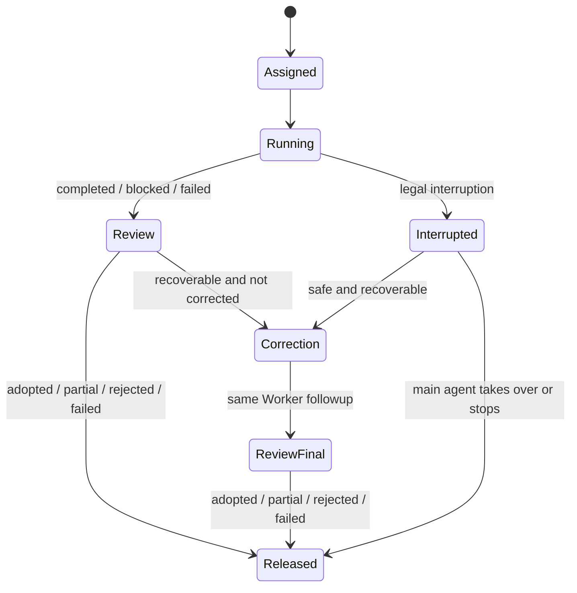

# Harness Engineering

Use harness engineering as the default way to work across projects: choose proportionate execution safeguards and capture only durable knowledge that future work actually needs.

## Risk Lanes

Choose the lightest lane that safely covers the observed blast radius. Escalate when repository evidence contradicts the initial classification; do not escalate merely because a heavier check or another skill exists.

### Fast Lane

Use when the request is clear, the change is cohesive and local, the current worktree is safe, and the change does not affect shared contracts, shared configuration, dependencies, generated artifacts, migrations, deployment, data, permissions, or security-sensitive behavior. File count is only a signal; a cohesive three-file local fix can remain Fast Lane.

Inspect only the relevant state and code, edit in the current worktree, run `git diff --check`, and select the narrowest relevant lint or test. Do not create a task worktree, durable document, execution plan, full build, browser session, or global stale-worktree scan unless the user requests it or evidence requires escalation. Harness itself does not require a remote fetch before a local Fast Lane edit.

### Standard Lane

Use for cohesive local features and fixes that exceed the Fast Lane but do not touch Heavy Lane surfaces. Read the relevant workflow, use a task worktree when coupling, repository state, or likely interruption makes isolation useful, and validate affected behavior without automatically running every available check.

### Heavy Lane

Use for medium or large changes, shared behavior or contracts, configuration, generated artifacts, dependencies, migrations, releases, deployment, production operations, data, security, permissions, or unclear blast radius. Use the full worktree, documentation, validation, integration, and stop-condition workflow where applicable.

File count is a signal, not a hard boundary. A one-file security change is Heavy Lane; a cohesive three-file local fix can remain Fast Lane.

## Worker-first Delegation

Worker scheduling is a coverage gate after request and risk classification, not an optional optimization.
For every user task, the main agent must route each safely delegable, bounded, independently verifiable
execution or evidence-gathering unit to a direct Worker before doing that work itself, regardless of task
size, expected duration, or number of targets. This includes a single repository, page, source, or question
and applies even when no files are modified. Direct main-agent execution is limited to immediate answers
that need no evidence-gathering or tool work, the exclusions below, or work that cannot be made into an
objectively verifiable Worker unit.

For a clear single-target read-only evidence task, the main agent has a prerequisite-only phase before
dispatch: read explicitly triggered Skills, classify risk, and write the seven-field contract with its
required-evidence checklist. During that phase it must not inspect the target, discover domain tools, call
the network, or announce that it will perform the primary research itself. The Worker is the primary
evidence owner; the main agent owns acceptance and synthesis and must not describe it as cross-validation.
Once those prerequisites are complete, the next domain action is `spawn_agent`.

Use `deepseek_v4_flash_worker` for clear, bounded, independently verifiable units such as inventory,
contract tracing, test authoring or execution, read-only research, focused validation, isolated local
changes, and bounded Heavy Lane implementation. The main agent resolves architecture, product,
dependency, migration, and release decisions before dispatch; a larger implementation unit still needs
fixed interfaces and an objective check, not delegated ambiguity.

### Work-unit coverage

Only dispatch a unit that is clear, repeatable, independently owned, and has an objective validation
or focused result inspection. The scan must consider, where applicable:

- codebase inventory, symbol/reference search, and file ownership mapping;
- API, schema, field, and other contract tracing;
- focused test authoring or test execution with isolated fixtures and outputs;
- read-only research, documentation inspection, and compatibility evidence gathering;
- single-target repository, page, source, or question inspection;
- a local implementation in an exclusively owned path or module; and
- independent verification of a result, diff, invariant, or focused check.

For Standard or Heavy Lane work, the main agent completes risk classification and any required worktree
bootstrap before dispatching independent units. A worker always operates in the selected task worktree,
never the original worktree by accident.

### Dispatch and response contract

Every Worker dispatch starts with exactly one `Route: <skill>/<phase>` line, followed by these seven
headings, even when a field is `N/A`:

- `Objective`: one concrete, independently acceptable result;
- `Ownership`: the absolute worktree path, allowed read/write paths, and exclusively owned state;
- `Starting State`: the branch, base commit, existing dirty paths, and any accepted prerequisite work;
- `Interfaces`: inputs, outputs, or contracts that must remain compatible;
- `Constraints`: exclusions, prohibited changes, and other hard boundaries;
- `Git Boundary`: whether commit is allowed, with push, tag, PR/MR, branch, and worktree operations
  forbidden unless explicitly authorized; and
- `Verification`: exact commands or objective inspection criteria.

Before dispatch, the main agent turns the requested result into an itemized required-evidence checklist
inside `Verification`. Each item names the exact target or question, the acceptable source, artifact, or
command output, and what makes that item complete. Vague instructions such as "research the repository"
or "check the relevant files" are not independently acceptable. The checklist must be specific enough
that review can identify a missing item without reopening the full task.

For a write unit, the absolute worktree path in `Ownership` identifies the execution root; exclusivity
applies only to the explicitly allowed write paths and named mutable state within that root. `Starting
State` and `Git Boundary` are required rather than inferred; a read-only unit uses `N/A` where a field
does not apply. The Worker must not guess an omitted boundary.

Every `spawn_agent` call governed by this workflow must set `agent_type` explicitly to
`deepseek_v4_flash_worker`. Never omit `agent_type`, use the generic default Worker for a routed unit, or
infer a role afterward from the unit's complexity. The task message must contain the exact `Route:` line so
the runtime log records both the selected Worker and route.

Because Codex may encrypt the logged task message, `task_name` must also begin with an auditable route
prefix: `route__<skill>__<phase>__<purpose>`. Convert hyphens in the route to underscores. For example,
`Route: tdd/implementation` uses a task name such as `route__tdd__implementation__money_contract`.
Doctor treats the message line as canonical when readable and otherwise resolves this prefix against the
installed route registry; a disagreement between the two forms is invalid.

A worker whose scope or ownership remains ambiguous returns `Status: blocked` instead of expanding the
task. Every worker response uses these headings:

- `Status: completed|blocked|failed`;
- `Changes`;
- `Verified`;
- `Judgment Calls`; and
- `Gaps`.

For a read-only unit, `Changes` records the evidence produced and explicitly states that no files were
changed. `Verified` maps results and source links, file paths, or command outputs to every required-evidence
checklist item; `Gaps` names every item that remains missing or uncertain. The response contract makes
review predictable; it does not transfer integration or decision ownership away from the main agent.

### Ownership lifecycle and correction

Worker ownership follows `Assigned -> Running -> Review -> Released`, with `Interrupted` and one
`Correction` turn as bounded branches:



While `Running`, `Correction`, or waiting for the correction result, the Worker keeps exclusive
ownership of its write paths. The main agent may read the diff, prepare review, or work on disjoint
paths, but must not edit an owned path. Parallel Workers must have disjoint write paths. The main agent
records release before taking over an owned path; after takeover, the original Worker cannot write that
path again unless a new work unit establishes a fresh boundary.

During review, the main agent compares the response against the required-evidence checklist and records a
gap-only delta. When a required, safely delegable item is missing, the main agent must send that delta to
the same Worker through `followup_task` before performing overlapping evidence-gathering itself. The
correction request contains exactly `Correction: 1/1`, the missing checklist items, the permitted delta,
the required source or tool output, and the verification to rerun. The Worker performs any new inspection
needed to close those items; merely restating or reformatting the first response is not a correction.

While a correction is running, the main agent may review existing evidence or work on disjoint units, but
must not duplicate the Worker's assigned research or implementation. After `followup_task`, check the
Worker's current state with `list_agents` before waiting. If it is still running, issue at most one bounded
`wait_agent`, then check `list_agents` again after a timeout. Never issue two consecutive `wait_agent`
calls without an intervening status snapshot.

For a clear single-target read-only unit or its correction, each `wait_agent` uses `timeout_ms` no greater
than `10000`, with a cumulative wait budget of 30 seconds between useful progress or evidence updates.
After every timeout, take another `list_agents` snapshot and stop waiting as soon as the Worker is terminal.
A fast research unit must not use a 120-second wait. Longer units may use a larger task-specific timeout
only when their expected duration was established before dispatch.

Each work unit gets at most one same-Worker correction. If the correction still fails, classify and release
that unit. When the remaining evidence is still required and safely delegable, define the unresolved items
as a new narrow Worker unit; the main agent may take over only when delegation is excluded, unavailable, or
unverifiable, or when the user redirects the work. It must not silently repeat the original full research.
Every newly spawned follow-on unit receives its own correction budget, independent of corrections used by
earlier units. If that follow-on result has recoverable checklist gaps, use its own `Correction: 1/1` before
main-agent takeover. An unrelated new work unit always uses a new `spawn_agent`; it must not reuse the same
Worker thread.

Only the main agent may interrupt a Worker, and only for one of these reasons:

- `overlap`: an ownership or write conflict exists;
- `unsafe`: a security or destructive-operation risk appears;
- `scope_violation`: the Worker clearly exceeded its assigned scope;
- `user_redirect`: the user changed or ended the requested direction; or
- `unresponsive`: there is no useful progress and the Worker cannot close normally.

Needing an ordinary correction is not an interruption reason. When a direct Worker turn is actually
interrupted, the root task appends this exact structured line once:

```text
Worker 中断：overlap=<n> unsafe=<n> scope_violation=<n> user_redirect=<n> unresponsive=<n>
```

Workers are strict leaves. They must not call collaboration tools such as `spawn_agent`,
`followup_task`, `send_message`, `wait_agent`, `list_agents`, or `interrupt_agent`; they must not poll,
wait for, message, or coordinate the main agent or another agent. When blocked, a Worker returns its
terminal `Status: blocked` report immediately. When its unit is complete or has failed, it returns the
corresponding terminal report immediately instead of waiting for other work or coordination.
The tracked `deepseek_v4_flash_worker` config enforces this boundary with `[agents] enabled = false`;
do not rely on prompt compliance alone to keep a Worker from spawning another agent.

### Scheduling and parallelism

Within each root session, at most 8 direct `deepseek_v4_flash_worker` threads may be open concurrently,
excluding the main thread. This per-root peak is cap-enforced. Aggregate/global peaks across roots are
informational diagnostics only; they do not redefine the per-root cap. The main agent closes or reuses
completed threads and queues additional units until a slot is free. Do not bypass the cap through nested or
indirect workers.

Duration boundaries are advisory planning guidance: when practical, split a Worker unit expected to exceed
30 minutes before dispatch. This is not a mechanical timeout, and an ordinary long turn is not an
interruption reason.

Parallel units must have disjoint write paths, mutable state/resources, and validation ownership. Shared
generated outputs, fixtures, databases, ports, services, credentials, or validation commands count as
overlap; serialize the units when disjointness cannot be demonstrated before dispatch.

Cross-provider dispatch to `deepseek_v4_flash_worker` must carry the task twice: put the exact seven-field
contract in the `spawn_agent` task message and write the same complete task into the parent context
immediately preceding the call. Use `fork_turns = "1"`. Never use `fork_turns = "none"` for a routed
Flash unit, because it does not deliver the task reliably across providers. Never use a full-history fork
or `fork_turns = "all"`; worker prompts must remain self-contained and bounded.
Because the forked turn may also contain parent-only coordination instructions, the tracked Worker
developer instructions identify the leaf role explicitly and require direct execution of the latest
`Route:` plus seven-field contract without inspecting collaboration-tool availability.

### Scope and exclusions

The main agent owns architecture, product, dependency, migration, and release decisions. A Worker may
collect side-effect-free evidence for those decisions and may implement a resulting bounded Heavy Lane unit
only after the main agent fixes its interfaces, allowed paths, exclusions, and verification.

Database queries and mutations, security behavior, permission changes, production operations, uploads,
releases, destructive actions, and external Git or platform mutations remain with the main agent. A domain
Skill may delegate a specifically identified read-only preflight, but never the protected operation itself.
Shared configuration, cross-module contracts, generated artifacts, and mutable shared state require main
agent ownership unless the domain Skill explicitly isolates a bounded implementation phase.

### Routing precedence

Apply routing in this order: safety rules and exclusions, an explicit user request, the activated domain
Skill or Workflow's stage route, then the global Worker-first fallback. A domain Skill owns its method and
stage-to-Worker mapping; this workflow owns the shared dispatch, scheduling, acceptance, and failure
protocol. A Worker must not silently replace a route selected by the domain Skill.

### Review and failure handling

The main agent owns coordination, conflict resolution, review, integration, final validation, and the
final answer. Treat every worker diff, artifact, and summary as untrusted until reviewed against its
scope and validation. Review the actual diff or evidence, confirm that owned paths and interfaces were
respected, and independently rerun the critical verification before adopting a result.

An interrupted turn followed by the one allowed same-Worker correction remains one work unit. Do not
classify the interrupted turn as terminal `failed` solely because it was interrupted; review the final
corrected result once and classify that work unit once. If no correction is allowed or the final review
still fails, classify the terminal result according to the rules below.

Every completed root turn that used a named Worker appends exactly one final, unencrypted protocol marker:

```text
Worker 协议：version=10
```

When a same-Worker correction or an invalid Worker reuse occurred, append exactly one correction marker as
well:

```text
Worker 纠错：started=<n> completed=<n> failed=<n> violations=<n>
```

For this marker, `started` counts associated followup turns that started, `violations` counts associated
followup turns that violated the single-correction reuse rule, and the associated followup-turn count is
`started + violations`. The terminal accounting invariant is `completed + failed = started`. `completed`
counts a followup turn whose runtime status is `completed`, even when its evidence is later classified as
partial or rejected; `failed` is reserved for a turn-level failed terminal status. Acceptance quality is
recorded only in the applicable `Flash 验收` outcome, not in correction execution accounting.
Followup messages may be encrypted, so Doctor reconciles this unencrypted final marker instead of reading followup
plaintext. Historical roots without the v10 marker remain informational and are not v10 protocol
compliance failures. Doctor parses v9 Luna/Terra roots only as historical compatibility data.

The v10 protocol marker does not relax the existing conditional reports. A direct Worker interruption must
append the exact interruption line above once. A completed root turn that used
`deepseek_v4_flash_worker` must append exactly one Flash acceptance line:

```text
Flash 验收：adopted=<n> partial=<n> rejected=<n> failed=<n>
```

Classify each terminal Worker unit during that review:

- `adopted`: the result is used without material correction;
- `partial`: a substantive part is used after correction or restructuring;
- `rejected`: a completed result is reviewed but no substantive part is used; or
- `failed`: the unit is blocked, fails, is interrupted, or produces no reviewable result.

For completed root turns that used a role, the required applicable acceptance line records the reviewed
work-unit totals. Keep each line exact and do not substitute prose for its machine-readable fields.

Count work units, including queued units run by reusing an existing Worker thread. Assign each unit to
`deepseek_v4_flash_worker` only when that exact value was passed in `spawn_agent.agent_type`; never
reconstruct the role from its task, model, name, or result. Flash's four values cover every terminal unit
accepted for that Worker, and their sum must equal the number of terminal named-Worker units. A failed spawn
that never creates a thread is an operational caveat, not a work unit. If a completed root turn contains
safely delegable execution or evidence-gathering work but uses no Worker, append exactly one line with the
applicable reason:

```text
Worker 路由：not_delegated reason=excluded|overlap|unavailable|unverifiable
```

Make one correctly configured spawn attempt only; continue locally when safe or stop and report the
blocker. Do not retry failed spawns or failed Worker validation in an automatic loop, and never report an
unverified Worker result as success.

## Validation Matrix

Choose the smallest set of checks that can credibly detect a regression in the changed surface. Do not duplicate equivalent checks merely for ceremony.

| Change surface | Default validation |
| --- | --- |
| Copy, simple condition, or formatting | `git diff --check` and target-file lint when available |
| Local behavior with an existing test seam | Focused test and target lint |
| Single-page UI layout or interaction | Target lint or component test; browser validation only when the material result cannot be established otherwise |
| Shared component, type, or API contract | Focused tests plus typecheck or the narrowest relevant build |
| Dependency, shared configuration, generated artifact, or build pipeline | Relevant full test/build path |
| Push, release, deployment, or production operation | Project-required validation and integration preflight |

## Documentation Shape

Keep each project's `AGENTS.md` short. It should be a map with entrypoints, source-of-truth links, meaningful boundaries, and concise deployment or validation notes. Do not let it become a large encyclopedia.

Keep the global `~/.codex/AGENTS.md` focused on highest-priority cross-project behavior. If a workflow becomes long or detailed, prefer moving the detailed procedure to a separate durable note such as `~/.codex/docs/workflows/<topic>.md` and keep only the governing rule and link in `AGENTS.md`.

Put durable project knowledge in structured `docs/` files. Prefer this structure for medium or large projects:
- `docs/product-specs/`: product requirements, business specifications, and user-visible behavior.
- `docs/engineering-rules/`: engineering constraints, business invariants, and rules agents must follow.
- `docs/exec-plans/`: execution plans, migration plans, release plans, and larger change plans.
- `docs/references/`: external references, research notes, and cited source material.

Adapt to the project instead of forcing structure mechanically:
- If a project already has an equivalent documentation structure, use and improve it.
- For small projects or one-off rules, `AGENTS.md` or a single `docs/engineering-rules.md` may be enough.
- Create the full recommended structure only when the project has enough long-lived product specs, engineering rules, execution plans, or references to justify it.
- When no equivalent document exists, start from the minimal templates under `~/.agents/skills/harness-engineering/assets/project-harness/` and adapt them to the project. Do not copy placeholders unchanged.

## Language Consistency

When the user writes in Chinese, or the current conversation is mainly Chinese, ordinary task progress updates and final summaries should be in Chinese. Avoid raw English template headings for completed work, changed files, validation, and manual verification. Keep commands, paths, API names, package names, code symbols, and original error text unchanged.

## Durable Knowledge Capture

This workflow is the single source of truth for automatic product/spec and engineering-rule capture. `AGENTS.md` and skills may link here but must not define competing capture criteria. A direct user request to create or edit documentation remains an ordinary task; automatic knowledge capture discovered while doing another task follows the gate below.

### Capture Gate

Create or update a durable product/spec or engineering-rule document only when all three conditions are true:

1. The content should remain true after the current session ends.
2. Upcoming implementation genuinely depends on the decision, or the rule prevents a repeated error supported by concrete evidence.
3. Current code, existing documentation, and user-confirmed direction contain no unresolved conflict about the content.

If any condition is false or unknown, keep the information in the conversation or current execution context. Do not write it as project truth.

Do not automatically capture:

- ordinary fixes, local implementation details, temporary debugging, or exploratory findings;
- one-off preferences, obvious facts already expressed by code, or routine validation results;
- unconfirmed options, proposals, or plans discussed only in conversation;
- documentation created only because a task is in Standard or Heavy Lane or touches a particular number of files;
- a conclusion that conflicts with an existing rule, spec, code path, or user instruction and has not been resolved.

Plan Mode, read-only analysis, and work that has not entered execution do not write project documentation. Ordinary tasks do not run a routine capture audit. Perform a lightweight audit only when the work actually surfaces a candidate durable decision, project invariant, or evidenced repeat correction.

### Capture Scope

- Product behavior and operational decisions require explicit user confirmation and must be about to guide implementation, configuration, deployment, or operation. Otherwise leave them in the conversation.
- Engineering rules are limited to reusable project invariants or repeat corrections backed by a concrete failure, regression, or review history. A cross-project rule always requires explicit user confirmation before changing global documentation.
- Prefer the project's existing canonical document. If no suitable document exists, create at most one minimal file in the nearest established documentation location; do not generate the full recommended directory tree.
- When a confirmed decision replaces an older rule in the same scope, update or remove the old canonical wording so only one active rule remains. Git history preserves the old version. If replacement or scope is not explicitly resolved, stop automatic capture and report the conflict.
- Never store secrets, credentials, OAuth tokens, cookies, passwords, private keys, full sensitive URLs, raw confidential prompts, or private operational data. Use placeholders and non-sensitive metadata only.

When durable documentation is changed, follow `~/.codex/docs/workflows/document-gardening.md` to check the files in scope for canonical ownership, duplication, contradiction, and obsolete wording.

## Executable Checks

When a rule can be checked mechanically, prefer encoding it as a script, test, lint rule, CI check, or documented validation command instead of relying only on Markdown.

When an engineering rule passes the Capture Gate, explicitly decide whether a small executable check should also be added. Keep the check scoped, deterministic, and easy to run locally. If no check is useful, documentation alone is sufficient; explain the choice only when it materially affects the task or the user asks.

## Harness Health

Use `python3 ~/.agents/skills/harness-engineering/scripts/harness_doctor.py doctor` as the fast read-only core health check after changing Harness skills, workflow documents, templates, or worktree policy. It verifies Harness skill metadata and routing declarations, required files, and deterministic index drift without scanning repository worktrees or session history.

Use `python3 ~/.agents/skills/harness-engineering/scripts/harness_doctor.py doctor --full` for periodic maintenance or when diagnosing global Harness health. The full check also validates all skill metadata, checks runtime visibility, reports worktree lifecycle debt without changing it, and summarizes recent rule-capture markers. A rule-capture marker count is informational; tasks without a material rule or documentation change are not expected to emit an empty status line.

Full Doctor output is grouped into `Skills`, `Worktrees`, and `Sessions`. Use repeatable `--section skills`, `--section worktrees`, or `--section sessions` with `--full` to limit scanning and output. Session completion counts are deduplicated across log files by `turn_id`; `raw_completed` and `duplicates_skipped` keep the source volume visible.

Session reports expose Flash lifecycle and work-unit outcomes from the exact final-answer acceptance line.
Report version 10 also exposes per-root Worker concurrency peaks, aggregate global peaks for information,
route matches, route mismatches, unknown routes, and valid no-delegation reasons. Per-root peaks enforce the
Worker cap; global peaks are informational. Historical missing outcome lines and roots without the v10
protocol marker remain informational; nested Workers, per-root concurrency overruns, route mismatches, and
invalid route reports produce session warnings. Doctor continues to parse v9 Luna/Terra sessions as
historical compatibility data; they do not define active dispatch requirements.

Document gardening is an optional section and is not included in the default full scan. Run `python3 ~/.agents/skills/harness-engineering/scripts/harness_doctor.py doctor --full --section docs --repo-root <repo>` only when the documentation-gardening workflow calls for it.

After adding, removing, renaming, installing, copying, or migrating a user-managed skill, run:

```bash
python3 ~/.agents/skills/harness-engineering/scripts/harness_doctor.py index --write
python3 ~/.agents/skills/harness-engineering/scripts/harness_doctor.py index --check
```

`doctor` and `index --check` are read-only. Only `index --write` may update `~/.agents/skills-index.md`. A warning is informational in normal mode and fails under `doctor --strict`; errors always fail. Do not use Doctor findings as authorization to mutate project state.

Run `python3 ~/.agents/skills/harness-engineering/scripts/harness_doctor.py cleanup --safe --older-than-days 7` as periodic maintenance, not after every Git task. Never run it for Fast Lane work. For Standard or Heavy Lane completion, run it only when no successful global cleanup is known within the preceding 24 hours; when uncertain, skip the scan and leave it to the next periodic Harness maintenance pass. With no `--repo-root`, it scans only the current Git project; pass `--repo-root` repeatedly to include additional roots. Cleanup is fail-closed and restricted to stale, clean, merged, unlocked, unledgered, inactive `codex/*` worktrees. It never pushes; unsafe or unknown states are retained. Use `--dry-run` for manual inspection and diagnostics.

## Planning And Gardening

Create or update an execution plan only after execution begins and only when a larger, interruptible, or operational task materially benefits from resumable state. Do not persist a plan merely because it was discussed, because Plan Mode is active, or because the task is classified Standard or Heavy Lane.

For long-running or interruptible work, keep the execution plan usable as a progress ledger. It should link to the source product/spec requirement, record implementation status by work item, note blockers and decisions, list validation/deployment status, and leave concrete next steps or commands so a later session can resume without reconstructing the conversation.

For lingering task worktrees, keep a lightweight cross-task ledger in the integration or main worktree's execution-plan area or equivalent durable notes. The ledger exists so future sessions can discover unfinished task work from the main project entrypoint. If a dirty, unmerged, stale, or missing-on-disk worktree is discovered, inspect it read-only first and record its path, branch, status, changed-file summary, validation state if known, and recommended next step. Do not automatically delete, prune, reset, merge, or discard it unless the user explicitly asks or the standard worktree cleanup rules prove it is fully merged and clean.

Do not dirty the integration or main worktree only to record a ledger entry. If the current task created an isolated ledger or rule-documentation update and it can be staged by explicit path without mixing unrelated changes, commit that documentation update separately. This also applies when the integration or main worktree has unrelated local changes that are safe to leave alone. If the ledger update is not path-isolated, overlaps unrelated user changes, or cannot be committed safely, do not write it into the main worktree; include the proposed ledger entry in the final response and pause for user direction.

When validation fails but appears unrelated to the current change, record the exact failing command, the observed failure, why it is believed to be pre-existing or out of scope, whether it blocks the current task, and the recommended follow-up. Do not silently treat unrelated validation failures as success.

When changing durable docs or `AGENTS.md`, capturing a rule, closing an execution plan, or performing explicitly requested deep gardening, read and follow `~/.codex/docs/workflows/document-gardening.md`. Do not run this audit for an ordinary task with no documentation change or Capture Gate candidate, and do not read memory by default.

At the end of a task, mention rule capture, executable-check changes, or documentation gardening only when one of them materially changed. Use the user's conversation language and keep the note compact. Do not emit a routine all-empty status line. If the user asks for the audit result, report both changes and explicit no-change outcomes.
